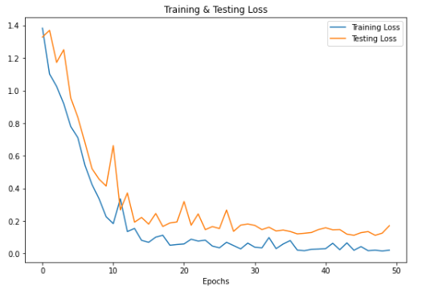
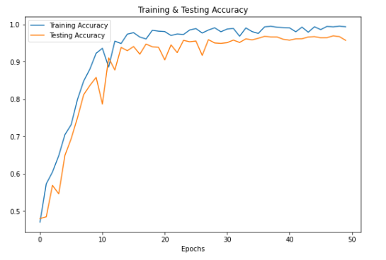
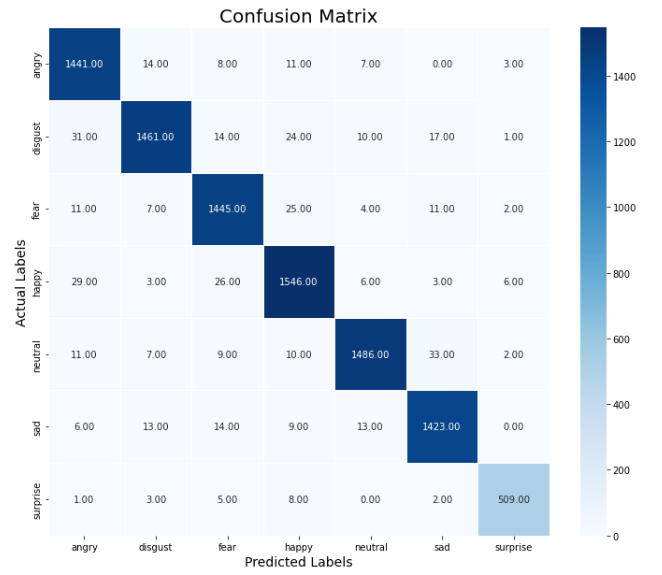
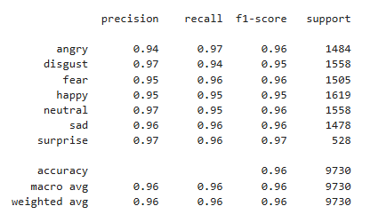

# Speech Emotion Recognition

This project implements a **Speech Emotion Recognition** system that classifies emotions from speech samples using deep learning models. The project uses four datasets: **CREMAD**, **RAVDESS**, **SAVEE**, and **TESS**. The model achieves an accuracy of **96%** by combining CNN, LSTM, and CLSTM architectures, along with data augmentation techniques and feature extraction methods.

## Datasets
The following datasets are used for training and testing:

- **CREMAD**: A dataset of emotional speech for automatic detection.
- **RAVDESS**: The Ryerson Audio-Visual Database of Emotional Speech and Song.
- **SAVEE**: The Surrey Audio-Visual Expressed Emotion (SAVEE) dataset.
- **TESS**: Toronto emotional speech set, consisting of speech data with various emotions.

## Features Extracted
- **MFCC (Mel-frequency cepstral coefficients)**
- **Zero Crossing Rate**
- **RMS (Root Mean Square)**

## Data Augmentation Techniques
- **Time Shifting**
- **Pitch Shifting**
- **Time Stretching**
- **Noise Addition**

## Models Used
- **CNN (Convolutional Neural Networks)**
- **LSTM (Long Short-Term Memory)**
- **CLSTM (Convolutional LSTM)**

These models were trained on the combined dataset and evaluated for emotion classification.

## Accuracy
The model achieved **96%** accuracy after training.

## How to Run the Project

1. **Import into Kaggle**:
    - Go to the [Kaggle](https://www.kaggle.com/) and import this notebook into your Kaggle environment.
   
2. **Add Datasets**:
    - Upload the datasets (CREMAD, RAVDESS, SAVEE, TESS) to the Kaggle notebook by navigating to the “Datasets” tab and adding them to your notebook.

3. **Run the Notebook**:
    - Run the notebook step-by-step to preprocess the data, perform feature extraction, apply data augmentation, and train the models.
    - Ensure that the necessary libraries are installed in the Kaggle environment.

4. **Training**:
    - Once the datasets are loaded and prepared, you can run the training code to train the CNN, LSTM, or CLSTM models and evaluate the performance.

## Results
The model achieves an accuracy of **96%** on the evaluation dataset, with the following confusion matrix and performance metrics:

